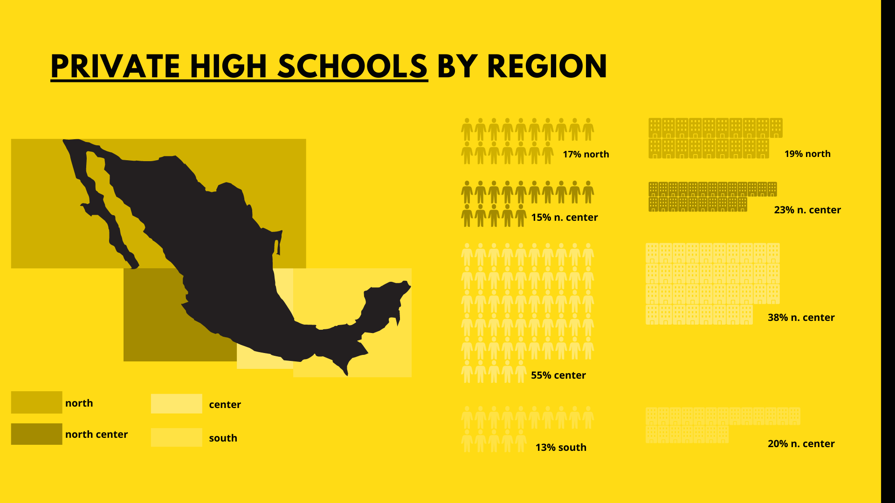

# Light Networks
Executed  the financial planning and analysis of Light Networks.,a simulated company in the network industry who is enter a new market within the educational segment. The repository includes market research, competition analysis, industry trends, financial forecast, budgeting &amp; financial analysis. Techniques used: machine learning (time series, regressions, cluster classification)

